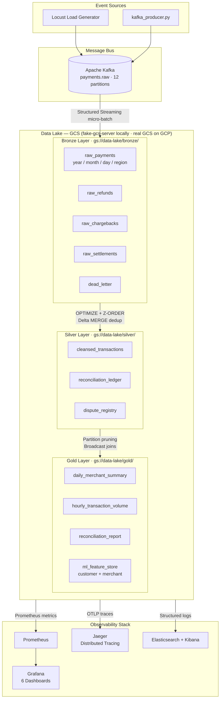
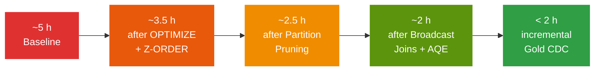
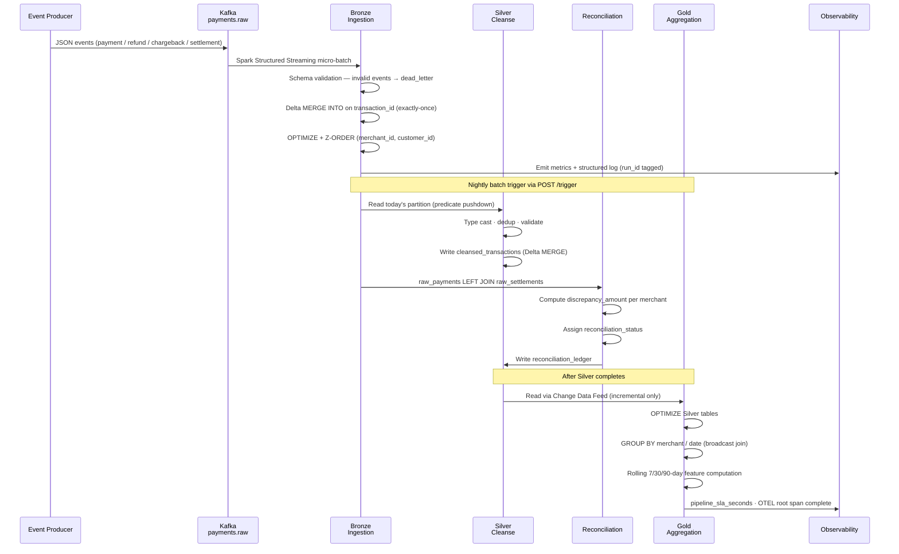
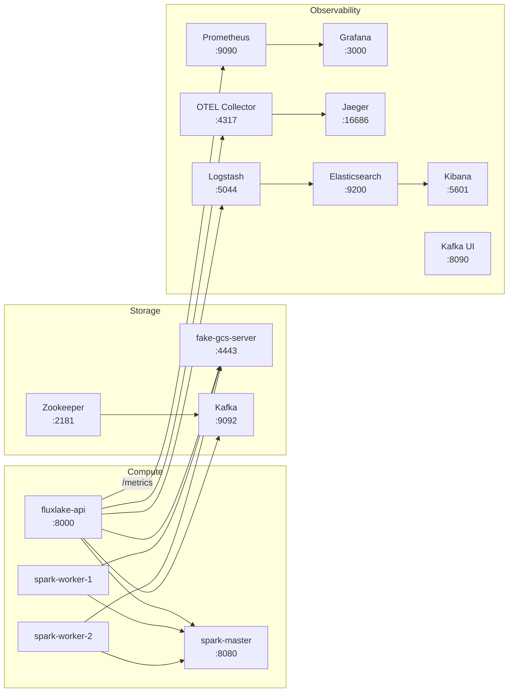
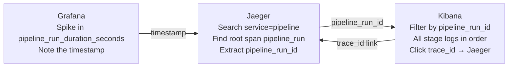

<div align="center">

# FluxLakeGCP

**PySpark · Delta Lake · Apache Kafka · GCS · Full Observability**

[](https://python.org)
[](https://spark.apache.org)
[](https://delta.io)
[](https://kafka.apache.org)
[](https://docker.com)
[](tests/)
[](LICENSE)

**60% SLA improvement** — daily batch runtime reduced from ~5 hours to under 2 hours via Delta OPTIMIZE, Z-ORDER clustering, partition pruning, broadcast joins, and Adaptive Query Execution.

*Simulates a payments and e-commerce platform with daily batch reconciliation, historical aggregations, and a curated ML-ready feature store — all running locally with a single `make up`.*

</div>

---

## Table of Contents

- [Features](#-features)
- [Architecture](#-architecture)
- [System Design](#-system-design)
- [Data Flow](#-data-flow)
- [Getting Started](#-getting-started)
  - [Prerequisites](#prerequisites)
  - [Installation](#installation)
  - [Configuration](#configuration)
  - [Running Locally](#running-locally)
- [Service URLs](#-service-urls)
- [API Reference](#-api-reference)
- [Deployment](#-deployment)
- [Monitoring & Observability](#-monitoring--observability)
- [Troubleshooting](#-troubleshooting)
- [Development Guide](#-development-guide)
- [Testing](#-testing)
- [Contributing](#-contributing)
- [License](#-license)

---

## ✨ Features

| Capability | Details |
|---|---|
| **Medallion Architecture** | Bronze (raw landing) → Silver (cleansed/reconciled) → Gold (aggregated/ML-ready) |
| **Exactly-once Ingestion** | Delta `MERGE INTO` on `transaction_id` — every pipeline run is fully idempotent |
| **60% SLA Improvement** | From ~5 h baseline to <2 h via OPTIMIZE, Z-ORDER, AQE, broadcast joins, and CDC |
| **Financial Reconciliation** | Payments vs. settlements with discrepancy detection and configurable tolerance bands |
| **ML Feature Store** | 7/30/90-day rolling customer and merchant features written directly to the Gold layer |
| **Full Observability** | Prometheus metrics · OpenTelemetry traces (Jaeger) · Structured logs (ELK) · 6 Grafana dashboards |
| **ACID Guarantees** | Delta Lake transactions across all three layers — safe for concurrent Spark workers |
| **Time Travel & Audit** | `VERSION AS OF` lets you reprocess or audit any historical date |
| **Unified GCS Storage** | `fake-gcs-server` locally, real GCS on GCP — same `gs://` URI and connector in both environments |
| **One-command Local Stack** | `make up` starts 16 services; `make seed && make run-pipeline` gives a full working dataset |

---

## 🏗 Architecture

### High-Level Overview



### SLA Optimization Funnel



---

## 🔩 System Design

<details>
<summary><strong>fake-gcs-server over MinIO</strong></summary>

`fake-gcs-server` implements the real GCS REST API, so both local dev and production use the same Hadoop GCS connector and `gs://` URI scheme — no connector swap, no `AWS_*` env vars, no S3A path. The only difference between environments is whether `GCS_EMULATOR_HOST` is set (local) or unset (production, where ADC handles auth).

</details>

<details>
<summary><strong>Spark Standalone over Kubernetes (local dev)</strong></summary>

Kubernetes adds significant setup overhead (kind/minikube, node pools, RBAC). Spark Standalone mode delivers a real multi-worker cluster with the exact same code path, running in Docker Compose with a single command. Production would use GKE with the Spark Operator or GCP Dataproc, but the pipeline code is identical.

</details>

<details>
<summary><strong>Delta Lake over Parquet / Iceberg</strong></summary>

Delta provides ACID transactions, schema enforcement, time travel, and `OPTIMIZE`/`Z-ORDER` all as first-class operations with Python/Scala APIs. The reconciliation use case specifically requires atomic writes and time travel for audit trails.

</details>

<details>
<summary><strong>Exactly-once via MERGE</strong></summary>

The Bronze layer uses `MERGE INTO` on `transaction_id` rather than `INSERT`. This makes every pipeline run idempotent — safe to rerun on failures without duplicating data.

</details>

### Delta Lake Feature Usage

| Feature | Where Used | Why |
|---|---|---|
| ACID transactions | All writes | Concurrent Spark workers cannot corrupt tables |
| Schema enforcement | Bronze ingest | Rejects malformed events at write time |
| Schema evolution | Silver → nullable columns | Add ML feature columns without full rewrites |
| Time travel | Reconciliation audit | `VERSION AS OF` reprocesses any historical date |
| Z-ORDER | Silver `merchant_id` / `customer_id` | 60–80% data skip on merchant-scoped Gold queries |
| OPTIMIZE | Before Gold aggregation | Eliminates small-file overhead from streaming micro-batches |
| VACUUM | Scheduled | Reclaims storage from superseded Delta versions |
| Change Data Feed | Silver → Gold | Recomputes only Gold partitions where Silver changed |

---

## 🔀 Data Flow

### Pipeline Execution Sequence



### Partition Strategy

| Layer | Partition Keys | Rationale |
|---|---|---|
| Bronze | `year / month / day / region` | Regional partition supports geo-filtered queries |
| Silver | `year / month / day` | Date-aligned with SLA window (process yesterday's data) |
| Gold | `report_date` | Single-column partition — queries always filter by exact date |

---

## 🚀 Getting Started

### Prerequisites

| Requirement | Minimum | Notes |
|---|---|---|
| Docker Desktop | Latest | 16 GB RAM recommended; 20 GB free disk |
| GNU Make | 4.x | Pre-installed on macOS/Linux |
| Python | 3.10+ | Only needed to run tests outside Docker |

> **Tip:** On macOS with Apple Silicon, ensure Docker Desktop has at least 16 GB of memory allocated in Settings → Resources.

### Installation

```bash
# 1. Clone the repository
git clone https://github.com/amudhan023/flux-lake-gcp.git
cd flux-lake-gcp

# 2. Copy environment template
cp .env.example .env

# 3. Start the full stack (first pull takes ~5 min)
make up
```

### Configuration

All tunable parameters live in `.env` (copy from `.env.example`):

| Variable | Default | Description |
|---|---|---|
| `SPARK_WORKERS` | `2` | Worker count — scale with `SPARK_WORKERS=8 make up` |
| `SPARK_EXECUTOR_MEMORY` | `4g` | Memory per executor |
| `SPARK_EXECUTOR_CORES` | `2` | CPU cores per executor |
| `KAFKA_PARTITIONS` | `12` | Topic partition count |
| `GCS_BUCKET` | `data-lake` | GCS bucket name (local emulator) or real GCS bucket on GCP |
| `GCS_EMULATOR_HOST` | `fake-gcs-server:4443` | GCS emulator endpoint — unset on GCP to use real GCS |
| `STORAGE_BACKEND` | `gcs` | `gcs` for local/GCP; `local` for tests (plain file paths, no connector) |
| `ENABLE_DELTA_OPTIMIZE` | `true` | Run `OPTIMIZE` before Gold aggregation |
| `ENABLE_ZORDER` | `true` | Z-ORDER on `merchant_id`, `customer_id` |
| `ENABLE_AQE` | `true` | Adaptive Query Execution |
| `ENABLE_BROADCAST_JOINS` | `true` | Broadcast small dimension tables |
| `ENABLE_INCREMENTAL_GOLD` | `true` | Delta CDC incremental Gold processing |
| `DELTA_VACUUM_RETENTION_HOURS` | `168` | Delta time-travel retention window (7 days) |

### Running Locally

```bash
# Start the full stack
make up

# Seed 90 days of historical Bronze data (~450k records)
make seed

# Run the full Bronze → Silver → Gold pipeline
make run-pipeline
```

All services are healthy when `make up` prints the service URL table. The pipeline run typically completes in **under 2 hours** with default settings (2 workers, 4 g memory).

---

## 🌐 Service URLs

| Service | URL | Credentials |
|---|---|---|
| Spark Master UI | http://localhost:8080 | — |
| GCS Emulator API | http://localhost:4443 | — |
| Kafka UI | http://localhost:8090 | — |
| Grafana | http://localhost:3000 | `admin` / `admin123` |
| Jaeger | http://localhost:16686 | — |
| Kibana | http://localhost:5601 | — |
| FluxLake API | http://localhost:8000 | — |
| Prometheus | http://localhost:9090 | — |

---

## 📡 API Reference

The FluxLake API is a lightweight FastAPI service (`src/python/fluxlake_api.py`) that controls and exposes the pipeline.

### `GET /health`

Returns service liveness.

```json
{ "status": "ok" }
```

### `GET /status`

Returns the current or last pipeline run state.

```json
{
  "status": "complete",
  "run_id": "run_20260612_020000_abc123",
  "duration_s": 5832.4,
  "completed_at": "2026-06-12T04:17:12Z"
}
```

Possible `status` values: `idle` · `running` · `complete` · `failed`

### `POST /trigger`

Triggers a full Bronze → Silver → Gold pipeline run asynchronously.

```bash
curl -s -X POST http://localhost:8000/trigger | python3 -m json.tool
```

```json
{
  "message": "Pipeline triggered",
  "run_id": "run_20260612_020000_abc123"
}
```

Poll `/status` to track progress. The `run_id` (format: `run_YYYYMMDD_HHMMSS_xxxxxx`) correlates across Grafana, Jaeger, and Kibana.

### `GET /metrics`

Prometheus text-format scrape endpoint — consumed by the bundled Prometheus instance.

---

## 🐳 Deployment

### Docker Compose Services



### Make Targets Reference

```bash
# ── Local (fake-gcs-server) ───────────────────────────────────────────────────
make up               # Start the full stack (16 services)
make down             # Tear down full stack (removes volumes)
make infra-up         # Start infrastructure only (Spark, Kafka, fake-gcs-server, observability)
make infra-down       # Tear down infrastructure
make seed             # Seed 90 days of historical Bronze data
make run-pipeline     # Trigger full Bronze → Silver → Gold pipeline
make load-test        # Run all 4 Locust load test scenarios
make benchmark        # SLA comparison benchmark (~15 min)
make logs             # Tail all container logs
make grafana          # Open Grafana in browser
make kibana           # Open Kibana in browser
make jaeger           # Open Jaeger in browser

# ── GCP (real GCS backend) ────────────────────────────────────────────────────
make gcp-up           # Start stack on GCP (requires .env.gcp — copy from .env.gcp.example)
make gcp-down         # Tear down GCP stack
make gcp-seed         # Seed Bronze data on GCP
make gcp-run-pipeline # Trigger pipeline on GCP
make gcp-logs         # Tail GCP stack logs
```

> For full GCP deployment instructions see [`docs/gcp-deployment.md`](docs/gcp-deployment.md).

### Scaling Spark Workers

```bash
# Scale to 4 workers without restarting other services
SPARK_WORKERS=4 make up

# Scale directly via Docker Compose
docker compose up -d --scale spark-worker-1=4
```

---

## 📊 Monitoring & Observability

### Prometheus Metrics Reference

<details>
<summary><strong>Pipeline SLA Metrics</strong></summary>

| Metric | Type | Labels | Description |
|---|---|---|---|
| `pipeline_run_duration_seconds` | Histogram | `stage`, `pipeline_name` | Duration of each pipeline stage |
| `pipeline_records_processed_total` | Counter | `stage`, `table` | Records written to each Delta table |
| `pipeline_last_success_timestamp` | Gauge | `pipeline_name` | Unix timestamp of last successful finish |
| `pipeline_sla_seconds` | Gauge | `pipeline_name` | Total pipeline wall-clock time |

</details>

<details>
<summary><strong>Delta Lake Health Metrics</strong></summary>

| Metric | Labels | Description |
|---|---|---|
| `delta_files_before_optimize` | `table` | File count before OPTIMIZE |
| `delta_files_after_optimize` | `table` | File count after OPTIMIZE |
| `delta_optimize_duration_seconds` | `table` | Time OPTIMIZE took |
| `delta_vacuum_files_deleted` | `table` | Files reclaimed by VACUUM |

</details>

<details>
<summary><strong>Data Quality Metrics</strong></summary>

| Metric | Labels | Description |
|---|---|---|
| `dq_null_rate` | `table`, `column` | Fraction of nulls in a key column |
| `dq_duplicate_count` | `table` | Records removed by deduplication |
| `dq_reconciliation_discrepancy_total` | `type` | Flagged discrepancies (`amount_mismatch` / `missing_settlement`) |

</details>

### Grafana Dashboards

Six pre-built dashboards are provisioned automatically on `make up`:

| Dashboard | Key Panels | Alert Threshold |
|---|---|---|
| **Pipeline Overview** | SLA trend (7-day), stage breakdown, run success rate | >25 h since last success |
| **Spark Performance** | Shuffle bytes, executor memory, task failures | Any task failure increment |
| **Delta Lake Health** | Files before/after OPTIMIZE, OPTIMIZE duration | OPTIMIZE >10 min |
| **Kafka Topics** | Consumer lag, messages/sec | Lag >5 min after burst |
| **SLA Comparison** | Per-stage slow vs. optimized bar chart (from `make benchmark`) | — |
| **Data Quality** | Null rate per column, reconciliation discrepancies | Null rate >0 on `merchant_id` |

### Correlating Grafana → Jaeger → Kibana

Every pipeline run is assigned a `pipeline_run_id` (format: `run_YYYYMMDD_HHMMSS_xxxxxx`). This ID propagates across all three observability systems:



### Example Distributed Trace

```
pipeline_run  (root span · ~93 min total)
├── silver_cleanse          (38 min)
│   ├── dedup_merge         → Delta MERGE on 50 M records
│   └── quarantine_write    → 0.01% of records flagged to dead_letter
├── reconciliation          (20 min)
│   └── reconciliation_join → daily_payments LEFT JOIN daily_settlements
└── gold_aggregation        (35 min)
    ├── delta_optimize      → 842 files compacted
    ├── merchant_daily_summary  → broadcast join + GROUP BY
    └── hourly_volume       → GROUP BY hour, currency, region
```

Each span reports: `table_name`, `records_count`, `partition_date`, `spark_job_id`.

---

## 🔬 Data Model

<details>
<summary><strong>Bronze — Event Types</strong></summary>

**`payment_created`** — 80% of traffic

| Field | Type | Description |
|---|---|---|
| `transaction_id` | STRING NOT NULL | Globally unique payment ID |
| `merchant_id` | STRING NOT NULL | Merchant identifier (`merch_1..merch_500`) |
| `customer_id` | STRING NOT NULL | Customer identifier (`cust_1..cust_10000`) |
| `amount` | DOUBLE NOT NULL | Transaction amount |
| `currency` | STRING | ISO 4217 code (`USD`, `EUR`, `GBP`, `SGD`) |
| `gateway` | STRING | Payment processor |
| `region` | STRING | Geographic region — Bronze partition key |
| `timestamp` | STRING | ISO 8601 event time |

**`refund_initiated`** — 10%

| Field | Type | Description |
|---|---|---|
| `refund_id` | STRING NOT NULL | Unique refund ID |
| `original_tx_id` | STRING | References `payment_created.transaction_id` |
| `refund_amount` | DOUBLE | Partial or full refund |
| `reason_code` | STRING | `customer_request` / `fraud` / `duplicate` |

**`chargeback_filed`** — 2%

| Field | Type | Description |
|---|---|---|
| `dispute_id` | STRING NOT NULL | Unique dispute ID |
| `original_tx_id` | STRING | References `payment_created.transaction_id` |
| `dispute_amount` | DOUBLE | Full amount disputed |
| `status` | STRING | `filed` / `under_review` / `resolved_*` |

**`settlement_processed`** — 8%

| Field | Type | Description |
|---|---|---|
| `batch_id` | STRING NOT NULL | Settlement batch identifier |
| `merchant_id` | STRING NOT NULL | Merchant receiving funds |
| `gross_amount` | DOUBLE | Pre-fee settlement total |
| `fees` | DOUBLE | Gateway/processing fees |
| `net_amount` | DOUBLE | `gross_amount - fees` |

</details>

<details>
<summary><strong>Silver — Curated Tables</strong></summary>

**`cleansed_transactions`** — All `payment_created` fields, plus:

| Added Field | Type | Description |
|---|---|---|
| `amount_decimal` | DECIMAL(18,2) | Cast and validated amount |
| `event_ts` | TIMESTAMP | Parsed from string timestamp |

Partitioned by: `year / month / day`

**`reconciliation_ledger`**

| Field | Type |
|---|---|
| `merchant_id` | STRING |
| `payment_date` | DATE |
| `payment_amount` | DECIMAL(18,2) |
| `settled_amount` | DECIMAL(18,2) nullable |
| `discrepancy_amount` | DECIMAL(18,2) |
| `reconciliation_status` | STRING |
| `reconciled_at` | TIMESTAMP |

Status values: `reconciled` · `reconciled_within_tolerance` · `discrepancy_flagged` · `awaiting_settlement`

</details>

<details>
<summary><strong>Gold — Analytics & ML Tables</strong></summary>

**`daily_merchant_summary`**

| Field | Type |
|---|---|
| `merchant_id` | STRING |
| `report_date` | DATE |
| `transaction_count` | LONG |
| `total_amount` | DECIMAL(18,2) |
| `avg_amount` | DECIMAL(18,2) |
| `unique_customers` | LONG |

**`hourly_transaction_volume`**

| Field | Type |
|---|---|
| `hour` | TIMESTAMP |
| `currency` | STRING |
| `region` | STRING |
| `transaction_count` | LONG |
| `total_volume` | DECIMAL(18,2) |

**`ml_feature_store`** (customer + merchant variants)

Rolling aggregations over 7, 30, and 90-day windows — ready for direct consumption by ML training pipelines.

</details>

---

## 🧪 Testing

### Test Suite Overview

| Suite | Command | Duration | Requirements |
|---|---|---|---|
| Unit tests | `make test-unit` | ~30 s | Python only — no Docker |
| Integration tests | `make test-integration` | ~5 min | `make infra-up` first |
| Data quality | `make test-dq` | ~2 min | `make infra-up` first |
| SLA benchmark | `make benchmark` | ~15 min | Full stack (`make up`) |
| Load test | `make load-test` | ~60 min | Full stack (`make up`) |

```bash
# Full suite in one command (requires infra-up)
make test
```

### Load Test Scenarios

Four Locust scenarios are defined in `tests/load/locustfile.py`:

| Scenario | Events/min | Duration | Validates |
|---|---|---|---|
| **Normal Daily** | 10,000 | 60 min | Steady-state pipeline throughput |
| **Peak Traffic** | 10k → 100k → ramp down | 30 min | Backpressure handling under surge |
| **Batch Catchup** | High burst | 30 min | 30-day historical backfill |
| **Month-End Reconciliation** | 10,000 (5% bad settlements) | 60 min | Discrepancy detection accuracy |

> After `make load-test`, Grafana opens automatically to the Pipeline Overview dashboard for live monitoring.

### Running Specific Tests

```bash
# Single test file
python -m pytest tests/unit/test_silver_cleanse.py -v

# Integration tests only (needs infra-up)
python -m pytest tests/integration/ -m integration -v

# Coverage report
python -m pytest tests/unit/ --cov=src/python --cov-report=html
open htmlcov/index.html
```

---

## 🛠 Troubleshooting

### Common Issues

| Symptom | Likely Cause | Fix |
|---|---|---|
| `Connection refused: fake-gcs-server:4443` | GCS emulator not healthy yet | `make logs fake-gcs-server` — wait for `server started` |
| Spark OOM / executor killed | `SPARK_EXECUTOR_MEMORY` too low | Set `SPARK_EXECUTOR_MEMORY=8g` in `.env`, then `make down && make up` |
| Port already in use | Conflicting local process | `lsof -i :<port>` · kill the process · or remap in `docker-compose.yml` |
| Kafka `LEADER_NOT_AVAILABLE` | Kafka still initializing | Wait 30 s — brokers elect a leader within 15 s |
| `TransactionConflictException` | Two Spark writers racing on the same Delta partition | Delta retries automatically. If persistent, reduce `SPARK_WORKERS`. |
| Grafana shows no data | Pipeline has not run yet | Run `make seed && make run-pipeline` first |
| GCS bucket not found | `fake-gcs-init` did not complete | `make logs fake-gcs-init` — re-run `make up` if it failed |

### Reprocessing a Historical Date

```bash
# 1. Enter the fluxlake-api container
docker exec -it fluxlake-api bash

# 2. Open a PySpark shell connected to the cluster
pyspark --master spark://spark-master:7077

# 3. Delete the Gold partition for the date to reprocess
from delta.tables import DeltaTable
dt = DeltaTable.forPath(spark, "gs://data-lake/gold/daily_merchant_summary")
dt.delete("report_date = '2026-01-15'")

# 4. Re-trigger the pipeline for that specific date
import requests
requests.post("http://fluxlake-api:8000/trigger", json={"report_date": "2026-01-15"})
```

### Vacuuming Old Delta Files

```bash
# Keeps 7 days (168 h) of history — safe for time travel within that window
docker exec fluxlake-api python -c "
from src.python.utils.spark_session import get_spark_session
from src.python.optimization.delta_optimizer import vacuum_table
spark = get_spark_session()
for layer, table in [('silver','cleansed_transactions'), ('gold','daily_merchant_summary')]:
    result = vacuum_table(spark, layer, table)
    print(f'{layer}.{table}: {result[\"files_deleted\"]} files deleted')
"
```

### Resetting Kafka Consumer Offsets

```bash
# Reset to earliest (reprocess all events from the beginning)
docker exec kafka kafka-consumer-groups.sh \
  --bootstrap-server localhost:9092 \
  --group fluxlake-consumer \
  --topic payments.raw \
  --reset-offsets --to-earliest --execute

# Reset to a specific timestamp
docker exec kafka kafka-consumer-groups.sh \
  --bootstrap-server localhost:9092 \
  --group fluxlake-consumer \
  --topic payments.raw \
  --reset-offsets --to-datetime 2026-01-15T00:00:00.000 --execute
```

### Recovering from a Failed Pipeline Run

Delta's ACID guarantees mean tables are **always consistent** after a crash — no partial data is ever committed.

1. Identify the failed run: `curl http://localhost:8000/status` or check Grafana for the stalled `run_id`.
2. Find the failure point: `make logs | grep -E "ERROR|WARN"`.
3. Re-trigger: `make run-pipeline` — the pipeline is fully idempotent via `MERGE`.

If Silver is stuck mid-MERGE, verify the last committed version:

```bash
spark.sql("DESCRIBE HISTORY delta.`gs://data-lake/silver/cleansed_transactions`").show(5)
```

The last `COMMIT` entry is the authoritative state; everything after it was automatically rolled back.

---

## 👩‍💻 Development Guide

### Project Structure

```
flux-lake-gcp/
├── src/
│   └── python/
│       ├── pipeline/
│       │   ├── bronze/               # Kafka → Bronze ingestion + dead-letter
│       │   ├── silver/               # Cleanse, dedup, reconciliation
│       │   └── gold/                 # Daily aggregations, merchant analytics, ML features
│       ├── ingestion/                # Kafka producer + event schemas
│       ├── optimization/             # Delta OPTIMIZE, Z-ORDER, partition strategy
│       ├── metrics/                  # Prometheus client, SLA tracker, Spark listener
│       ├── tracing/                  # OpenTelemetry setup
│       └── utils/                    # Spark session factory, logging config
├── tests/
│   ├── unit/                         # Pure-Python tests, ~30 s, no Docker
│   ├── integration/                  # Real Spark + Delta, ~5 min
│   └── load/
│       ├── locustfile.py             # Entry point for all load scenarios
│       ├── scenarios/                # normal_daily, peak, catchup, reconciliation
│       └── event_samples/            # JSON fixtures for each event type
├── config/
│   ├── grafana/dashboards/           # 6 pre-built JSON dashboard definitions
│   ├── prometheus/prometheus.yml     # Scrape config
│   ├── spark/spark-defaults.conf     # AQE, shuffle, serialization tuning
│   ├── logstash/pipeline.conf        # ELK ingest pipeline
│   └── otel/otel-collector-config.yml
├── docs/
│   ├── architecture.md
│   ├── data_model.md
│   ├── observability.md
│   └── runbook.md
├── scripts/
│   ├── seed_data.py                  # Generates 90 days of Bronze data
│   ├── run_pipeline.py               # CLI wrapper around POST /trigger
│   └── benchmark_comparison.py      # Produces benchmark_results.json for Grafana
├── docker-compose.yml                # Full 12-service stack
├── docker-compose.infra.yml          # Infrastructure only (no fluxlake-api)
├── Makefile
└── .env.example
```

### Adding a New Gold Table

1. Create `src/python/pipeline/gold/your_aggregation.py` with a `run_your_aggregation(spark, run_id)` function.
2. Import and call it inside `_run_full_pipeline` in `src/python/fluxlake_api.py` within a `tracker.stage(...)` block.
3. Add a unit test in `tests/unit/test_gold_aggregations.py` using the `chispa` DataFrame equality helpers.
4. Add a Grafana dashboard panel pointing at the new Gold table via the Prometheus or Elasticsearch datasource.

---

## 🤝 Contributing

1. Fork the repository and create a feature branch.
2. Run `make test-unit` before committing — no Docker required.
3. For integration changes, run `make infra-up && make test-integration`.
4. Open a pull request with a description of what changed and why.
5. The PR description should include the output of `make benchmark` if performance-sensitive code changed.

---

## 📄 License

This project is licensed under the MIT License. See [LICENSE](LICENSE) for details.
